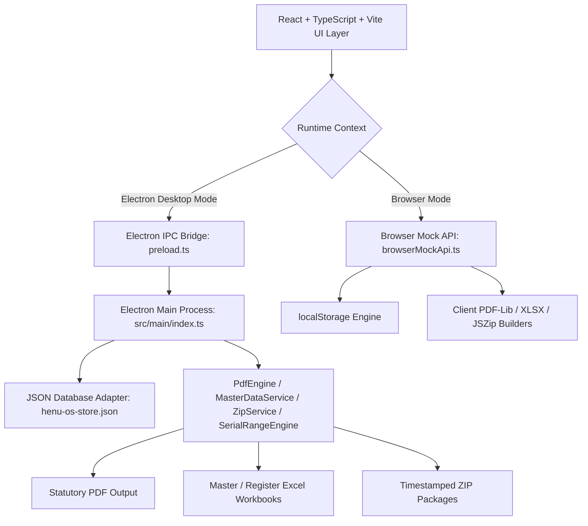

# HENU OS — Records Management System
## Complete Canonical Architecture, Module Specifications, Knowledge Base & Website Portal Blueprint

> **System Overview**: HENU OS is a specialized Co-operative Housing Society (CHS) statutory compliance, member records management, and document generation desktop platform engineered for high-precision PDF document publishing, statutory register generation (under state co-operative society acts / Model Bye-Laws), multi-society management, and real-time spreadsheet data synchronization.

---

## 📑 Table of Contents
1. [System Architecture & Runtime Environments](#1-system-architecture--runtime-environments)
2. [Data Layer & Multi-Society Isolation Model](#2-data-layer--multi-society-isolation-model)
3. [Comprehensive 14-Module Deep Dive](#3-comprehensive-14-module-deep-dive)
   - [01. Dashboard](#01-dashboard)
   - [02. Master Data (Architecture & Real-Time Spreadsheet)](#02-master-data)
   - [03. Control Center (Foundation Locking & Health Check)](#03-control-center)
   - [04. Generate Forms (Batch Generation & Live Preview)](#04-generate-forms)
   - [05. Form I (Register of Members)](#05-form-i)
   - [06. Form J (List of Members)](#06-form-j)
   - [07. Share Register](#07-share-register)
   - [08. Property Register](#08-property-register)
   - [09. Nomination Register](#09-nomination-register)
   - [10. Bank Lien Mark Register](#10-bank-lien-mark-register)
   - [11. Share Certificate (Standard & 13×19 Print)](#11-share-certificate)
   - [12. Payment Voucher (Legal 3-Per-Page)](#12-payment-voucher)
   - [13. Generated Files & History Repository](#13-generated-files--history-repository)
   - [14. Settings (Society Context & Typography Customization)](#14-settings)
4. [Master Data Canonical Schema & Field Mapping](#4-master-data-canonical-schema--field-mapping)
5. [Serial Number Engine & Range Calculation Rules](#5-serial-number-engine--range-calculation-rules)
6. [Validation Engine, Integrity Rules & Error Catalog](#6-validation-engine-integrity-rules--error-catalog)
7. [PDF Rendering Pipeline & Document Layout Specifications](#7-pdf-rendering-pipeline--document-layout-specifications)
8. [ZIP Packaging, File Naming & Output Formats](#8-zip-packaging-file-naming--output-formats)
9. [Website Portal & Knowledge Center Blueprint](#9-website-portal--knowledge-center-blueprint)
10. [Comprehensive AI Chatbot Grounding Knowledge Base](#10-comprehensive-ai-chatbot-grounding-knowledge-base)
11. [Legal, Compliance & Website Policies](#11-legal-compliance--website-policies)
12. [Structured Discovery Questionnaire for Implementation](#12-structured-discovery-questionnaire-for-implementation)

---

## 1. System Architecture & Runtime Environments

### 1.1 Dual-Runtime Dual-Engine Architecture
HENU OS is built with a resilient dual-runtime architecture ensuring identical functionality in both standalone desktop (Electron) and offline web browser preview environments:

### 1.2 Tech Stack
- **Frontend / Renderer**: React 18, TypeScript 5, Vite, Lucide Icons, Custom Design Tokens (`index.css`), Vanilla Glassmorphism.
- **Desktop Runtime**: Electron 31, Node.js 20, Custom TypeScript IPC context bridge.
- **Document Engine**: `pdf-lib` + `@pdf-lib/fontkit` with custom WinAnsi font wrapping and dynamic header/footer drawing.
- **Spreadsheet Engine**: `xlsx` (SheetJS) and `exceljs` with custom vertical/horizontal key-value parsers.
- **Packaging & Archives**: `jszip` with deterministic clean file structure.
- **Persistence**: `JsonDatabaseAdapter` with zero native C++ ABI crashes, instant file synchronization (`henu-os-store.json`), and automatic schema self-healing.

---

## 2. Data Layer & Multi-Society Isolation Model

### 2.1 Multi-Society Isolation
Every data record, master workbook, member list, form design customization, and PDF generation history is isolated by `society_id`:
- **Active Society Selector**: Switchable from the global top-right dropdown and Society Management settings.
- **Active Session Table**: `master_data_sessions` stores full JSON snapshots of uploaded/edited workbooks per society.
- **Branding & Logo Storage**: High-resolution square PNG logos (`data:image/png;base64,...`) stored directly per society and dynamically embedded on cover pages, certificates, headers, and vouchers.

### 2.2 Relational Entities in Local Store (`henu-os-store.json`)
1. **`societies`**: Stores society ID, official name, registration number, registration date, full address, city, state, PIN code, base64 logo, creation timestamp, and active flag.
2. **`master_data_sessions`**: Stores session UUID, society ID, source filename, record counts across all 8 sheets, validation errors/warnings JSON, complete workbook JSON, and upload timestamp.
3. **`generation_history`**: Stores record of generated batch outputs, form ID, serial range (`fromSerial` to `toSerial`), member count, blank count, PDF path, Excel export path, ZIP archive path, and generation timestamp.
4. **`settings`**: Stores key-value global application settings (`theme`, typography, color modes, grid configurations, margins, header logo offsets).
5. **`app_logs`**: System audit trail logging operations (`SOCIETY_CREATE`, `MASTER_DATA_UPLOAD`, `MEMBER_UPDATE`, `PDF_GENERATE`, `ZIP_EXPORT`).

---

## 3. Comprehensive 14-Module Deep Dive

### 01. Dashboard
- **Purpose**: Central executive summary and status control deck for the active co-operative housing society.
- **Key UI Elements**:
  - Active Society Badge: Displays official society name, registration number, and logo.
  - Health & Readiness Gauges: Total members, register completeness status, and generation readiness indicators.
  - Quick Generation Cards: Direct 1-click navigation to generate Form I, Form J, Share Register, Property Register, Nomination Register, Bank Lien, Share Certificate, and Voucher.
  - Recent Output Feed: Table of recently created PDFs and ZIP archives with direct folder open buttons.

### 02. Master Data
- **Purpose**: Master Excel workbook management, template downloading, multi-sheet importing, and real-time spreadsheet data editing.
- **Key Features**:
  - **Download Master Template**: Generates an 8-sheet structured `.xlsx` workbook populated with sample rows and column guidelines.
  - **Import Master Workbook**: Parses `.xlsx` / `.xls` files, automatically maps header variations, validates data consistency, and saves session.
  - **Export Master Data**: Exports currently active session data as a clean, standardized 8-sheet Excel workbook.
  - **Real-Time Spreadsheet Editor**:
    - Multi-Tab Navigation: `01_Society_Master`, `02_Common_Member_Master`, `03_Form_I`, `04_Form_J`, `05_Share_Register`, `06_Nomination_Register`, `07_Property_Register`, `08_Lien_Mark_Register`.
    - Interactive Grid: Cell-level editing with instant auto-save and immediate sync to PDF generators.
    - Grid Actions: `+ Add Row`, `Delete Row`, `Duplicate Row`, `Undo`, `Redo`, `Refresh`, `Quick Search & Filter`, and `Save Changes`.
    - Error Counter Badge: Live count of missing mandatory fields or duplicate serial numbers with red cell highlighting.

### 03. Control Center
- **Purpose**: Foundation data locking gatekeeper and sequential member range validation.
- **Sequential Validation Logic**:
  - **Foundation Gate 1 — Society Master**: Verifies that Society Name and Registration No. are filled.
  - **Foundation Gate 2 — Common Member Master**: Unlocked only when Foundation Gate 1 passes; verifies member count > 0.
  - **Register Unlocking**: When both foundation gates pass, all 8 statutory register modules unlock simultaneously.
- **Health Indicators**:
  - Available serial numbers (`Min Serial` to `Max Serial`).
  - Missing serial numbers detector (identifies gaps in sequences, e.g. `001`, `002`, `004` flags `003` as missing).
  - Print Blanks Counter: Incorporates additional blank unassigned share rows into range totals.

### 04. Generate Forms
- **Purpose**: Unified batch document generator with real-time live preview.
- **Key Controls & Options**:
  - **Form Selector**: Dynamic switching between all statutory registers and certificates.
  - **Serial Range Inputs**: `From Serial No.` (e.g. `001`) and `To Serial No.` (e.g. `050`).
  - **Print Blanks / Non-Serial Rows**: Configurable count of extra blank template sheets for manual registrar entries.
  - **Orientation Toggle**: `Portrait` vs. `Landscape` (respects statutory layout defaults).
  - **Rows Per Page**: Selectable density (`8`, `10`, `12`, `15` rows per sheet for tabular registers).
  - **Render Mode**: `Color` (custom palette) vs. `Black & White (B/W)` (grayscale printing mode).
  - **Live Preview Window**: 1:1 PDF preview rendered using the exact production rendering engine.
  - **Batch Generation Action**: Produces individual/consolidated PDF files and packages them into a clean timestamped ZIP archive.

### 05. Form I (Register of Members)
- **Statutory Standard**: Maharashtra Co-operative Societies Rules (Form 'I' under Rule 32 / Bye-Law No. 65).
- **Layout & Structure**:
  - Orientation: **Portrait** (A4).
  - Multi-Entry Share Tracking: Up to 5 share acquisition entries (Cash Book Folio, Application, Allotment, 1st Call, 2nd Call, Total Amount, Shares Range `From`–`To`, Certificate No.).
  - Multi-Entry Transfer Tracking: Up to 5 transfer entries (Date, Cash Book Folio, Transfer Certificate No., Transferred Shares Count, Balance Shares, Balance Certificate No., Amount).
  - Multi-Nominee Support: Up to 6 nominees with percentage allocation breakdown.
  - Multi-Member Joint Ownership: Up to 6 joint member names (`Member 1` through `Member 6`).

### 06. Form J (List of Members)
- **Statutory Standard**: Maharashtra Co-operative Societies Rules (Form 'J' under Rule 33 / List of Members entitled to vote).
- **Layout & Structure**:
  - Orientation: **Portrait** (A4).
  - Format: Continuous tabular list with header boxes, column numbers (1 to 7), serial numbers, membership numbers, joint member details, flat/tenement description, and admission dates.

### 07. Share Register
- **Statutory Standard**: Comprehensive Share Register & Allotment Ledger.
- **Layout & Structure**:
  - Orientation: **Landscape** (A4).
  - Two-Section Spread: Left Side (Allotment / Issue details: Cash Book Folio, Share Numbers `From`–`To`, Amount Paid) and Right Side (Transfer / Transmission details: Transfer No., Transferee Name, Certificate Folio).

### 08. Property Register
- **Statutory Standard**: Tenement, Flat & Commercial Unit Allocation Register.
- **Layout & Structure**:
  - Orientation: **Landscape** (A4).
  - Details: Flat/Unit No., Wing No., Floor, Area (Sq. Ft.), Carpet vs. Built-up, Tenement Type (Flat/Shop/Office/Gala), Tenement Cost, Land Cost, Construction Cost, Possession Date, Annual Ground Rent.

### 09. Nomination Register
- **Statutory Standard**: Nomination Register under Section 30 of MCS Act.
- **Layout & Structure**:
  - Orientation: **Landscape** (A4).
  - Details: Member Serial No., Member Full Name, Flat/Unit No., Nominee Names (1 to 6), Relationship with Member, Nominee Address, Percentage Allocation (summing to 100%), Date of Nomination, Managing Committee Meeting Date, Subsequent Revocation / Changes.

### 10. Bank Lien Mark Register
- **Statutory Standard**: Register of Mortgage, Bank Charge & Lien Marks on Flats/Units.
- **Layout & Structure**:
  - Orientation: **Landscape** (A4).
  - Details: Member Name, Flat No., Bank Name, Branch Address, Loan Amount, Loan Sanction Date, Loan Period, MC Resolution Approval Date, NOC Issue Date, Lien Discharge / Cancellation Date, Remarks. Supports multiple bank loan records (Loans 1 to 4).

### 11. Share Certificate
- **Standard & High-Precision 13×19 Print**:
  - Orientation: **Landscape** (13×19 Super A3 or Standard A4).
  - Page 1 (Front Side): Ornate Victorian border ornaments (Gold, Purple, Maroon, Blue), Society Name, Registration No. & Date, Address, Certificate No., Share Range `From`–`To`, Number of Shares, Face Value per share, Authorized Capital, Full Member Name, Flat/Unit No., Issue Date, Chairman/Secretary/Treasurer signature blocks.
  - Page 2 (Back Side / Transfer Ledger): Structured statutory transfer endorsement table with Date, Transfer No., Folio, Transferee Name, Authorized Signature, and Managing Committee Seal.

### 12. Payment Voucher
- **Format**: **Legal Paper (8.5 × 14 inch) 3-per-page portrait split**.
- **Layout & Calculations**:
  - Contains exactly 3 identical perforated payment vouchers per Legal sheet.
  - Header with Society Logo, Society Name, Address, Voucher Number, and Voucher Date.
  - Payee Name, Account/Charge Head, Payment Description, Bank Name, and Cheque No.
  - Complete Financial Breakdown: Bill Amount, Adv. Less Paid, Sub-Total 1, TDS % & Amount, Sub-Total 2, CGST % & Amount, SGST % & Amount, Round Off (+/-), Net Paid Amount.
  - Signatures: Prepared By, Checked By, Hon. Secretary, Chairman/Treasurer, and Payee Signature / Receiver Stamp.

### 13. Generated Files & History Repository
- **Purpose**: Persistent historical audit trail of all generated document packages.
- **Features**:
  - Table of all historical generation batches with timestamps, society name, form type, serial range, record count, and output file formats.
  - Quick Actions: Direct download/open of PDF, direct open of Excel export, and direct system folder view of ZIP archives in Windows File Explorer.
  - Clear History: Safe deletion of past history entries without affecting master workbook records.

### 14. Settings
- **Purpose**: Society profile management, global app configuration, and granular form design styling.
- **Customization Controls**:
  - **Society Management**: Add Society (with square PNG logo dropzone), Switch Active Society, Edit Profile, Delete Society.
  - **Typography & Font Family**: Selectable standard fonts (`Times-Roman`, `Helvetica`, `Courier`).
  - **Font Sizes**: Data Body Font Size (7.0 to 12.0 pt), Header Font Size (8.0 to 14.0 pt).
  - **Color Palette & Theme**: Primary Text Color, Header Background Fill, Cell Background Fill, Table Border Color, Dark/Light Mode.
  - **Table Grid Styling**: Grid Line Toggle (`ON`/`OFF`), Grid Color, Grid Opacity (0–100%), Grid Line Thickness (0.25 to 1.00 pt).
  - **Branding & Footers**: Custom Branding Footer Text, Footer Alignment (Left/Center/Right), Dynamic Page Number Prefix (`Page 1 of N`).
  - **Header Logo Offsets**: Horizontal Logo Offset X (-20 to +100 pt), Vertical Logo Offset Y (-20 to +50 pt), Logo Render Size (24 to 60 pt).

---

## 4. Master Data Canonical Schema & Field Mapping

The Master Data workbook is structured into 8 core statutory sheets:

| Sheet Tab Name | Internal Sheet Key | Primary Canonical Fields |
|---|---|---|
| `01_Society_Master` | `societyMaster` | Society Name, Registration No., Registration Date, Address Lines 1–6, Email, Phone, Units Flat/Shop/Office/Gala, Print Blanks, Authorised Capital, Total Shares, Face Value. |
| `02_Common_Member_Master` | `commonFile` | Sr. No., Membership No., Share Certificate No., Shares Count, Share Value, Shares From–To, Allotment Date, Member 1–6 Names, Residential Address, Flat No., Wing No., Nominee Details. |
| `03_Form_I` | `formIData` | Member Serial, Admission Date, Entrance Fee Date, Occupation, Age, Multi-Entry Shares Held (1–5), Multi-Entry Shares Transferred (1–5), Multi-Nominee Breakdown (1–6). |
| `04_Form_J` | `formJData` | Member Serial, Membership No., Full Member Names (including joint holders), Tenement Description, Flat No., Date of Admission, Cessation Date & Reason. |
| `05_Share_Register` | `shareData` | Member Serial, Certificate No., Allotment Date, Shares Range From–To, Total Amount Paid, Transfer Date, Transferee Name, Balance Shares. |
| `06_Nomination_Register` | `nominationData` | Member Serial, Member Name, Flat No., Nominee 1–6 Names, Relationships, Addresses, Percentage Allocations (1–6), Nomination Date, MC Approval Date. |
| `07_Property_Register` | `propertyData` | Member Serial, Flat/Unit No., Wing, Floor, Tenement Type, Area (Sq. Ft.), Carpet/Built-up, Tenement Cost, Land Cost, Construction Cost, Possession Date, Ground Rent. |
| `08_Lien_Mark_Register` | `bankLineMarkData` | Member Serial, Member Name, Flat No., Bank Name, Branch, Loan Amount, Loan Sanction Date, MC Meeting Date, NOC Date, Lien Cancellation Date, Loan Remarks (1–4). |

---

## 5. Serial Number Engine & Range Calculation Rules

1. **Leading Zero Preservation**: Serial numbers are strictly treated as text keys (e.g. `'001'` never collapses into `'1'`).
2. **Inclusive Range Generation**: `generateRange("001", "005")` produces exactly 5 items: `["001", "002", "003", "004", "005"]`.
3. **Dynamic Zero-Padding**: If input is `'010'` to `'020'`, output maintains 3-digit padding (`'010'`, `'011'`, ..., `'020'`). If unpadded (e.g. `'1'` to `'10'`), numeric sequence without padding is generated.
4. **Blank Injection**: If `printBlanks` is set (e.g. `5` blanks), the system generates extra blank records following the highest serial number for registrar reserve sheets.
5. **Validation Invariants**:
   - `From Serial` must be $\le$ `To Serial`.
   - Empty or non-numeric serial inputs are flagged before execution.
   - Non-serial / blank count is added to total expected page counts.

---

## 6. Validation Engine, Integrity Rules & Error Catalog

### 6.1 Validation Rules
- **Rule V-01 (Mandatory Society Identity)**: `societyName` and `registrationNo` must not be blank.
- **Rule V-02 (Member Serial Integrity)**: `srNo` must be non-empty and unique across `02_Common_Member_Master`.
- **Rule V-03 (Primary Member Name)**: At least `member1` or `memberName` must be populated.
- **Rule V-04 (Nomination Percentage Sum)**: When multiple nominees are assigned, total percentage allocation should equal `100%`.
- **Rule V-05 (Share Range Sanity)**: `sharesTo` must be $\ge$ `sharesFrom`.

### 6.2 Error & Warning Codes
| Code | Level | Message | Remediation |
|---|---|---|---|
| `ERR_NO_SOC_NAME` | Critical | Society Name is required. | Enter Society Name in Society Master or Add Society modal. |
| `ERR_NO_REG_NO` | Critical | Society Registration Number is missing. | Provide the statutory registration number. |
| `ERR_EMPTY_SR_NO` | Error | Row {X} has an empty Serial Number. | Assign a valid serial number (e.g. 001). |
| `ERR_DUP_SR_NO` | Error | Duplicate Serial Number '{Y}' detected. | Ensure every member has a unique serial number. |
| `WARN_NOM_SUM` | Warning | Nominee percentages for member '{Z}' sum to {P}%, expected 100%. | Adjust nominee allocations in Nomination Register. |
| `WARN_MISSING_SR` | Warning | Serial gap detected: Serial '{G}' is missing from sequence. | Review member list in Control Center. |

---

## 7. PDF Rendering Pipeline & Document Layout Specifications

### 7.1 Single Pipeline Guarantee (Preview === Final PDF)
The desktop application and web version utilize **one unified rendering pipeline**:
- The preview shown in the UI iframe is generated by the identical `PdfEngine` and `PdfDocumentBuilder` that writes the production ZIP archive.

### 7.2 Dimension & Page Specs
| Document / Register | Paper Size | Dimensions (Points) | Orientation | Rows Per Sheet |
|---|---|---|---|---|
| **Form I** | A4 | $595.28 \times 841.89$ pt | Portrait | 1 Member (2 Pages / Dual-Spread) |
| **Form J** | A4 | $595.28 \times 841.89$ pt | Portrait | 10–15 Rows (Continuous) |
| **Share Register** | A4 | $841.89 \times 595.28$ pt | Landscape | 10 Rows (Continuous) |
| **Property Register** | A4 | $841.89 \times 595.28$ pt | Landscape | 10 Rows (Continuous) |
| **Nomination Register** | A4 | $841.89 \times 595.28$ pt | Landscape | 10 Rows (Continuous) |
| **Bank Lien Register** | A4 | $841.89 \times 595.28$ pt | Landscape | 8–10 Rows (Continuous) |
| **Share Certificate (13×19)** | Super A3 (13×19") | $936.00 \times 1368.00$ pt | Landscape | 1 Certificate (Front + Back) |
| **Payment Voucher (Legal)** | US Legal | $612.00 \times 1008.00$ pt | Portrait | 3 Vouchers per Page |

---

## 8. ZIP Packaging, File Naming & Output Formats

### 8.1 ZIP Naming Standard
Generated ZIP files follow strict deterministic naming:
`HENU_OS_{FORM_ID}_{SOCIETY_NAME}_{FROM_SERIAL}-{TO_SERIAL}_{TIMESTAMP}.zip`
*Example*: `HENU_OS_FORM_I_HENU_OS_PVT_LTD_001-044_1787129000.zip`

### 8.2 Internal PDF Naming within Archive
- **Form I**: `FORM_I_001.pdf`, `FORM_I_002.pdf`, ..., `FORM_I_044.pdf` (plus merged `FORM_I_CONSOLIDATED_001-044.pdf`).
- **Form J**: `FORM_J_001-044.pdf` (Multi-page document).
- **Share Register**: `SHARE_REGISTER_001-044.pdf`.
- **Property Register**: `PROPERTY_REGISTER_001-044.pdf`.
- **Nomination Register**: `NOMINATION_REGISTER_001-044.pdf`.
- **Bank Lien Mark**: `BANK_LIEN_MARK_001-044.pdf`.
- **Share Certificate**: `SHARE_CERTIFICATE_13X19_001-044.pdf`.
- **Payment Voucher**: `PAYMENT_VOUCHER_LEGAL_001-044.pdf`.

---

## 9. Website Portal & Knowledge Center Blueprint

The official HENU OS web portal will feature:
1. **Public Documentation Hub**:
   - Step-by-step onboarding walkthroughs.
   - Master Excel Template download repository with column-by-column formatting guides.
   - Detailed statutory register explanations and Maharashtra Co-operative Societies Act guidelines.
2. **Interactive Video & Visual Tutorials**:
   - Visual guides for importing workbooks, live spreadsheet editing, setting custom fonts/colors, and generating 13×19 share certificates.
3. **Troubleshooting & Diagnostic Tree**:
   - Searchable error message lookup with instant remediation steps.
4. **Feedback & Feature Request Portal**:
   - Structured user feedback forms with system diagnostic payload attachments.

---

## 10. Comprehensive AI Chatbot Grounding Knowledge Base

The AI chatbot will be grounded strictly in this verified codebase documentation:
- **Core Competencies**:
  - Answering "How do I..." questions for all 14 modules.
  - Explaining master template header requirements and cell formats.
  - Diagnosing import validation errors and explaining why serial numbers are locked or missing.
  - Guiding users through high-resolution 13×19 share certificate printing and 3-per-page legal voucher setups.
  - Explaining typography, margin offsets, custom header logo embedding, and B/W vs. Color rendering modes.

---

## 11. Legal, Compliance & Website Policies

The documentation website will include full statutory policies:
- **Privacy Policy**: 100% Local-First Data Privacy Commitment (no society records or personal member data transmitted to external servers).
- **Terms of Use**: Desktop software license, permissible usage, and co-operative society statutory compliance disclaimers.
- **Copyright Notice**: Intellectual property protection for HENU OS branding, template designs, and proprietary rendering algorithms.
- **Statutory Disclaimer**: Professional legal advice disclaimer regarding Model Bye-Laws and registrar filings.
- **Feedback & Website Policies**: Terms of submission for bug reports and feature requests.
- **Interactive Site Map**: Complete index of all knowledge base articles, tutorials, and policy documents.

---

## 12. Structured Discovery Questionnaire for Implementation

To finalize the website content, branding, and legal text, the following user inputs are gathered:

### Section A: Branding & Company Profile
1. **Official Entity Name**: What is the exact registered corporate/business name for HENU OS (e.g. *HENU OS Records Management Pvt. Ltd.*)?
2. **Support Contact Details**: What official support email, helpdesk URL, and phone number should be displayed across the website and policy documents?
3. **Brand Color Guidelines**: Are there specific secondary brand colors (beyond purple `#7C3AED` and navy `#1C355E`) desired for the public website?

### Section B: Product Distribution & Downloads
4. **Release Distribution Channel**: Will the desktop installer be distributed via direct `.exe` / `.msi` download, GitHub Releases, or a customer portal?
5. **Licensing Model**: Is HENU OS distributed as a perpetual license, subscription per society, or free open community edition?

### Section C: Statutory & Legal Policies
6. **Jurisdiction & Governing Law**: Which state / high court jurisdiction should be specified in the Terms of Use (e.g., *Jodhpur/Jaipur, Rajasthan, India* or *Mumbai, Maharashtra, India*)?
7. **Official Copyright Year & Entity**: Should the copyright string read `© 2026 HENU OS. All rights reserved.`?

---
*End of Canonical Documentation & Specification Report.*
