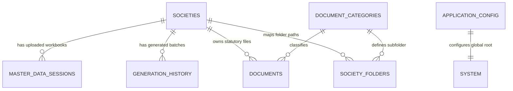

# HENU OS RECORD MANAGEMENT — AUDIT REPORT
## BACKUP/RESTORE + HENUMASTER DELETE + STORAGE ARCHITECTURE

**Document Type:** Master Audit & Safe Extension Blueprint (Prompt 1 of 2)  
**Date:** 2026-10-08  
**Repository:** [https://github.com/henu-os/Record-management-hs](https://github.com/henu-os/Record-management-hs)  
**Status:** AUDIT COMPLETED — NO CODE MODIFIED (STRICT AUDIT ONLY)

---

## 1. Executive Summary

This audit inspects the current architecture of **HENUMASTER**, **HENU CONFIG**, the **Database Storage Engine**, the **Physical Folder Hierarchy**, and the **Backup/Restore Subsystem**.

All findings, dependency maps, structural hierarchies, and root cause analyses have been documented below to ensure zero regressions during future implementation.

---

## 2. Current HENUMASTER Architecture

### Frontend Layer:
- **Location:** [`src/renderer/pages/henu-master/HenuMasterPage.tsx`](file:///g:/Astro/src/renderer/pages/henu-master/HenuMasterPage.tsx)
- **Components & Layout:**
  - **Header & Active Context Bar:** Displays current society name, refresh button, and "Create Society" action.
  - **KPI Metric Stat Cards (4 Cards):** Total Societies (Active vs Archived), Managed Documents, Storage Utilization (used bytes, available disk space, percentage), Society Integrity (Healthy vs Warnings).
  - **Search & Filter Bar:** Real-time search query input (name, registration no, city, state, address) and status filters (`ALL`, `ACTIVE`, `ARCHIVED`).
  - **Society Cards Grid:** Renders responsive cards (`repeat(auto-fill, minmax(360px, 1fr))`) detailing society name, registration info, storage size, document count, last document updated date, health badge, active context badge, and action menus.
  - **Overview Modal / Drawer:** Shows full register-by-register breakdown (Form I, Form J, Share Register, Property Register, Nomination Register, Bank Lien Mark, Share Certificate, Voucher), recent activity logs, storage path, and health diagnostics.
  - **Action Dialogs:** Switch Active Context, Edit Society Metadata, Archive Society, Restore Society, Export Executive Summary (`JSON`, `CSV`, `Text`).

### Backend Layer:
- **Location:** [`src/main/services/master/HenuMasterService.ts`](file:///g:/Astro/src/main/services/master/HenuMasterService.ts)
- **API Methods:**
  - `getDashboardStats()`: Aggregates real-time KPIs across database records and physical disk stats.
  - `listSocieties(filter)`: Queries societies, joins document counts and folder verification.
  - `getSocietyOverview(societyId)`: Computes statutory register breakdown, missing files list, and health check.
  - `updateSocietyMetadata(societyId, metadata)`: Safely updates metadata without breaking folder paths.
  - `archiveSociety(societyId)` / `restoreSociety(societyId)`: Toggles society status between `ACTIVE` and `ARCHIVED`.
  - `getRecentActivity(societyId, limit)`: Aggregates recent document saves and generation batches.
  - `exportSocietySummary(societyId, format)`: Exports printable summary or JSON/CSV data.

---

## 3. Current HENU CONFIG Architecture

- **Service:** [`src/main/services/config/HenuConfigService.ts`](file:///g:/Astro/src/main/services/config/HenuConfigService.ts)
- **Storage Engine:** [`src/main/services/config/StorageEngine.ts`](file:///g:/Astro/src/main/services/config/StorageEngine.ts)
- **Routing Engine:** [`src/main/services/config/DocumentRoutingService.ts`](file:///g:/Astro/src/main/services/config/DocumentRoutingService.ts)
- **Health Engine:** [`src/main/services/config/SystemHealthService.ts`](file:///g:/Astro/src/main/services/config/SystemHealthService.ts)
- **UI:** [`src/renderer/pages/henu-config/HenuConfigPage.tsx`](file:///g:/Astro/src/renderer/pages/henu-config/HenuConfigPage.tsx)
- **Nature of HENU CONFIG:**
  - HENU CONFIG is a **hybrid system**:
    1. **Physical Folder Tree:** Creates and verifies the root directory (`HENU OS RECMA`) and standard subfolders (`Societies`, `Backups`, `Exports`, `Imports`, `Logs`, `System/Database`).
    2. **Database Configuration:** Stores configuration settings in table `application_config`.
    3. **Application State:** Singleton services maintain configuration cache and routing rules.

---

## 4. Current Database Schema & Society Relationships

### Canonical Database Location:
- **Location:** `HENU OS RECMA/System/Database/` (`henu-os-store.json` / `henu-os.db`).
- The database is **GLOBAL** to the entire application. Society folders contain documents and generated registers; the database contains global tables and relations.



### Table Definitions & Foreign Key References:
1. **`societies`**:
   - `id` (PK, TEXT)
   - `society_name` (TEXT)
   - `registration_no` (TEXT)
   - `registration_date` (TEXT)
   - `full_address` (TEXT)
   - `city` (TEXT)
   - `state` (TEXT)
   - `pin_code` (TEXT)
   - `logo_base64` (TEXT)
   - `status` ('ACTIVE' | 'ARCHIVED')
   - `year_established` (TEXT)
   - `created_at` (TEXT)
   - `updated_at` (TEXT)
   - `is_active` (INTEGER: 0 or 1)
2. **`master_data_sessions`**: `society_id` references `societies.id`.
3. **`generation_history`**: `society_id` references `societies.id`.
4. **`documents`**: `society_id` references `societies.id`, `category_id` references `document_categories.id`.
5. **`society_folders`**: `society_id` references `societies.id`, `category_id` references `document_categories.id`.
6. **`document_categories`**: `id` (PK), `name`, `system_required`, `active`, `sort_order`.

---

## 5. Required Physical Folder Architecture

```
HENU OS RECMA/
│
├── Societies/
│   │
│   ├── Society 1/
│   │   ├── Form I/
│   │   ├── Form J/
│   │   ├── Share Register/
│   │   ├── Property Register/
│   │   ├── Nomination Register/
│   │   ├── Bank Lien Mark/
│   │   ├── Share Certificate/
│   │   ├── HENU OCR/
│   │   │   ├── VOUCHER/
│   │   │   └── CHECK/
│   │   └── Voucher/
│   │
│   ├── Society 2/
│   │   ├── Form I/
│   │   ├── Form J/
│   │   ├── Share Register/
│   │   ├── Property Register/
│   │   ├── Nomination Register/
│   │   ├── Bank Lien Mark/
│   │   ├── Share Certificate/
│   │   ├── HENU OCR/
│   │   │   ├── VOUCHER/
│   │   │   └── CHECK/
│   │   └── Voucher/
│   │
│   └── ...
│
├── Backups/
├── Exports/
├── Imports/
├── Logs/
└── System/
    └── Database/
        └── henu-os-store.json (or henu-os.db)
```

---

## 6. Society Creation & Folder Provisioning Workflow

### Current Flow:
1. User clicks **"Create Society"** in HENUMASTER or Header.
2. `society:create` IPC handler in `src/main/index.ts` creates the DB record in `societies`.
3. Calls `StorageEngine.createSocietyFolders(rootStoragePath, societyName, categoryNames)`.
4. `DocumentRoutingService.getCategories()` currently returns:
   `['Form I', 'Form J', 'Share Register', 'Property Register', 'Nomination Register', 'Bank Lien Mark', 'Share Certificate', 'Voucher']`.

### Target Extension for HENU OCR:
- In `StorageEngine.createSocietyFolders()`, automatically ensure nested directories:
  - `{SocietyPath}/HENU OCR/VOUCHER/`
  - `{SocietyPath}/HENU OCR/CHECK/`
- Register `HENU OCR/VOUCHER` and `HENU OCR/CHECK` categories in `DocumentRoutingService` so routing and document counts track them cleanly.

---

## 7. HENUMASTER Complete Society Deletion Mapping

To safely delete a society without leaving any orphaned records or folders:

### Deletion Dependency Checklist:
1. **Active Context Protection:**
   - If the deleted society is the currently active society (`is_active = 1`), atomically switch active context to the next available society in `societies`.
   - If no societies remain, set active context to `null`.
2. **Database Cascade Deletion:**
   - Delete from `societies` WHERE `id = :societyId`.
   - Delete from `master_data_sessions` WHERE `society_id = :societyId`.
   - Delete from `generation_history` WHERE `society_id = :societyId`.
   - Delete from `documents` WHERE `society_id = :societyId`.
   - Delete from `society_folders` WHERE `society_id = :societyId`.
3. **Physical Filesystem Deletion:**
   - Locate physical folder: `{Root}/Societies/{SanitizedSocietyName}`.
   - Verify path safety with `StorageEngine.isPathWithinRoot(societyPath, societiesRoot)`.
   - Recursively delete the society folder and its contents (`fs.rmSync(societyPath, { recursive: true, force: true })`).
4. **Cache & Memory Cleanup:**
   - If `activeMasterWorkbook` belongs to this society, reset `activeMasterWorkbook = null`.
   - Clear active session cache in `MasterDataService`.
5. **Audit Logging:**
   - Log operation in `app_logs` with level `'INFO'` and operation `'SOCIETY_DELETE_COMPLETE'`.

---

## 8. Backup & Restore Architecture Analysis

### Current Status:
- [`src/main/services/config/BackupService.ts`](file:///g:/Astro/src/main/services/config/BackupService.ts) currently uses `JSZip` to bundle `database/henu-os-store.json`, `system/application_config.json`, and `Societies/`.
- Saved to: `{Root}/Backups/HENU_BACKUP_{timestamp}_{label}.zip`.

### Target Dual-Mode Backup System:

#### Mode A: JSON Backup (Metadata & Database Snapshot)
- **Contents:**
  - `societies` records
  - `application_config`
  - `document_categories`
  - `documents` metadata table
  - `generation_history` metadata table
  - `master_data_sessions` metadata table
  - Timestamp, checksum, schema version
- **Target File:** `{Root}/Backups/HENU_BACKUP_METADATA_{timestamp}.json`
- **Use Case:** Lightweight, instant export of configuration and database state (does not include binary PDF files).

#### Mode B: FOLDER / ZIP Backup (Full or Custom Scoped Archive)
- **1. Default Full Backup:**
  - Archives the entire `Societies/` directory containing all societies and their subfolders.
  - Output: `{Root}/Backups/HENU_OS_RECMA_Societies_{timestamp}.zip`.
- **2. Custom Scoped Backup (Checkbox Tree Selection):**
  - Allows selecting specific societies (e.g., `Society 1`, `Society 2`).
  - Allows selecting specific sub-registers (e.g., `Form I`, `Share Register`, `HENU OCR/VOUCHER`, `HENU OCR/CHECK`).
  - Allows selecting `HENU CONFIG` (configuration snapshot `application_config.json`).
  - Dynamically packages only the selected paths into the resulting ZIP archive.

### Backup Safety Safeguards:
1. **Self-Inclusion Prevention:** `Backups/` directory is strictly excluded from being backed up into the archive.
2. **Atomic Write & Verification:** Archives are written to a temporary file (`.tmp.zip`) and verified before renaming to the final backup path.
3. **Database Concurrency Protection:** Reads database state in a single synchronous snapshot transaction to prevent reading mid-write files.

---

## 9. Restore Architecture Analysis

1. **ZIP Archive Restore:**
   - Inspects archive structure using `JSZip`.
   - Allows restoring entire societies or specific folders into active storage `{Root}/Societies/`.
   - Does not overwrite unselected societies.
2. **JSON Metadata Restore:**
   - Validates JSON structure, schema version, and required fields.
   - Option to merge or overwrite existing metadata.
   - Triggers `DocumentRoutingService.repairFileIndex()` to reconnect restored metadata with existing disk files.

---

## 10. HENUMASTER UI Layout Issue (Large Blank Margins)

### Exact Root Cause:
In [`src/renderer/pages/henu-master/HenuMasterPage.tsx`](file:///g:/Astro/src/renderer/pages/henu-master/HenuMasterPage.tsx) at line 233:
```tsx
<div className="page-container" style={{ padding: '24px 32px', maxWidth: 1400, margin: '0 auto' }}>
```
- The hardcoded `maxWidth: 1400` with `margin: '0 auto'` artificially constrains the main container width.
- On standard 1080p (1920×1080) and 1440p desktop screens (where available width inside `.main-content` is ~1680px), this leaves over **140px to 280px of empty dead space on both the left and right sides**.

### Proposed Minimal Fix:
- Replace `maxWidth: 1400, margin: '0 auto'` with:
```tsx
<div className="page-container" style={{ padding: '24px 32px', width: '100%' }}>
```
- The inner responsive CSS grids:
  - Stats: `gridTemplateColumns: 'repeat(auto-fit, minmax(220px, 1fr))'`
  - Society Cards: `gridTemplateColumns: 'repeat(auto-fill, minmax(360px, 1fr))'`
  will automatically and cleanly expand to fill the entire workspace without altering fonts, colors, padding, or card proportions.

---

## 11. Exact Files Requiring Modification (in Implementation Prompt 2)

| File | Purpose of Future Change |
| :--- | :--- |
| [`src/renderer/pages/henu-master/HenuMasterPage.tsx`](file:///g:/Astro/src/renderer/pages/henu-master/HenuMasterPage.tsx) | Remove `maxWidth: 1400` constraint; add "Delete Society" action with confirmation modal. |
| [`src/main/services/master/HenuMasterService.ts`](file:///g:/Astro/src/main/services/master/HenuMasterService.ts) | Add `deleteSociety(id)` method with complete cascade DB and filesystem cleanup. |
| [`src/main/services/config/StorageEngine.ts`](file:///g:/Astro/src/main/services/config/StorageEngine.ts) | Update society folder creation to automatically provision `HENU OCR/VOUCHER` and `HENU OCR/CHECK`. |
| [`src/main/services/config/DocumentRoutingService.ts`](file:///g:/Astro/src/main/services/config/DocumentRoutingService.ts) | Include `HENU OCR/VOUCHER` and `HENU OCR/CHECK` in default category definitions. |
| [`src/main/services/config/BackupService.ts`](file:///g:/Astro/src/main/services/config/BackupService.ts) | Add dual-mode backup (JSON vs FOLDER/ZIP) and custom scoped tree backup. |
| [`src/renderer/pages/henu-config/HenuConfigPage.tsx`](file:///g:/Astro/src/renderer/pages/henu-config/HenuConfigPage.tsx) | Update Backup tab UI with backup mode selection (JSON vs ZIP) and custom scope checkboxes. |
| [`src/main/preload.ts`](file:///g:/Astro/src/main/preload.ts) & [`src/main/index.ts`](file:///g:/Astro/src/main/index.ts) | Expose `deleteSociety` and scoped backup/restore IPC channels. |

---

## 12. Exact Files That Must Remain Untouched

- **Register Renderers:** `FormIRenderer.ts`, `FormJRenderer.ts`, `ShareRegisterRenderer.ts`, `NominationRegisterRenderer.ts`, `PropertyRegisterRenderer.ts`, `LienMarkRenderer.ts`, `ShareCertificateRenderer.ts`, `VoucherRenderer.ts`, `PdfDocumentBuilder.ts`.
- **Calculations & Serial Engines:** `SerialRangeEngine.ts`, `MasterDataQueryEngine.ts`, `ValidationEngine.ts`.
- **Form Definitions:** `FormIDefinition.ts`, `FormJDefinition.ts`, `ShareRegisterDefinition.ts`, etc.
- **OCR Modules:** `OcrRouter.ts`, `CheckOcrRouter.ts`, OCR worker scripts.
- **Master Data Excel Parsing:** `MasterDataService.ts`, `FormMappingService.ts`.

---

## 13. Safe Implementation & Regression Prevention Plan

1. **Phase 1: Storage Hierarchy & HENU OCR Subfolders**
   - Enhance `StorageEngine.createSocietyFolders()` so newly created societies immediately receive `HENU OCR/VOUCHER` and `HENU OCR/CHECK` folders.
   - Backward compatibility: existing societies retain their structure without disruption.

2. **Phase 2: Complete Cascade Deletion**
   - Implement `HenuMasterService.deleteSociety()` with full DB transaction and physical folder removal.
   - Connect to UI with double-confirmation dialog in HENUMASTER.

3. **Phase 3: Dual-Mode Backup & Custom Scoped Tree**
   - Implement JSON metadata backup (`HENU_BACKUP_METADATA_*.json`).
   - Implement custom scoped ZIP archive (`BackupService.createScopedBackup()`).
   - Enhance Backup UI with mode selector and granular folder checkboxes.

4. **Phase 4: HENUMASTER Full-Width Workspace Layout**
   - Adjust `HenuMasterPage.tsx` root container to `width: '100%'`.
   - Verify layout responsiveness across standard and high-resolution viewports.

---

**AUDIT COMPLETE — READY FOR IMPLEMENTATION PROMPT 2 UPON USER INSTRUCTION.**
